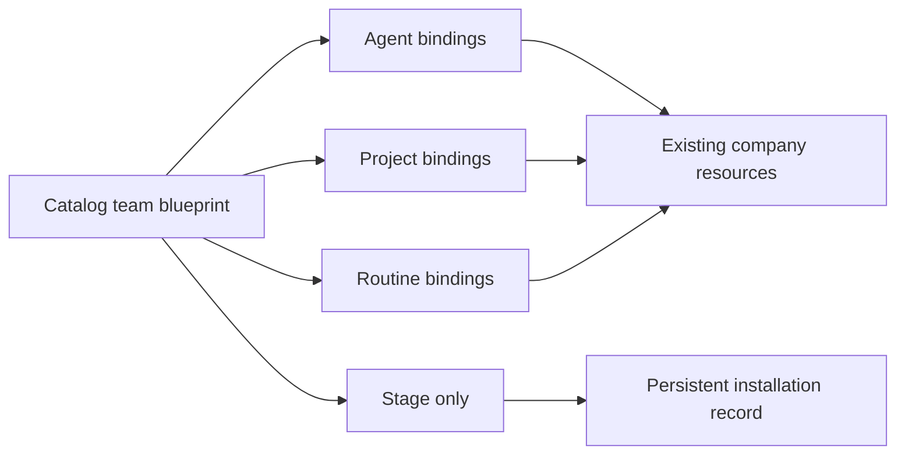

# Team catalog adoption and Softwarehouse normalization

Date: 2026-07-20

## Outcome

The Teams catalog is an installable blueprint layer, not a second organization chart. An install can now map catalog agents, projects, and recurring tasks to existing company records. Reused resources keep their instructions, adapter configuration, hierarchy, schedules, and status.

The install preview shows this deployment map explicitly. Each blueprint resource can be created or reused. `Stage only` records intent and provenance without creating resources, installing skills, or changing runtime state.

## LuckySparrow deployment

| Team | State | Agent mapping | Project mapping | Routine mapping |
| --- | --- | --- | --- | --- |
| Core Exec Team | installed | CEO → `00 AIA`; CTO → `09 CTO`; QA → `09 QVE` | `00 General: Softwarehouse` | First Heartbeat → `11 Innovation: Autonomy Governor` |
| Product Design | installed | UX Designer → `02 UXW` | `00 General: Softwarehouse` | no duplicate weekly routine |
| Product Engineering | installed | CTO → `09 CTO`; Senior Coder → `09 EDL`; QA → `09 QVE` | `00 General: Softwarehouse` | no duplicate weekly routine |
| Agent Enablement | installed | Partner → `06 AIM` | `00 General: Softwarehouse` | Daily Review → `06 People: AI-Agent Development Review` |
| Content Machine | staged | none | none | none |

Content Machine remains staged because content/marketing is outside the active Stage 1 operating scope. Activating it later is an explicit staffing and project decision.

No additional catalog teams were added. The current five cover the evidenced operating patterns; the organizational readiness audit says to add permanent capacity only after a concrete, repeated gap.

## Routine disposition and naming

The nine proven bounded routines remain active. Their titles now use the owning department prefix (`04`, `06`, `09`, or `11`). Six superseded routines were archived: the old liveness review, portfolio/workspace review, PDCA review, evidence/DoD review, source-control/deploy review, and the never-run activation draft.

Four specialist routines remain paused rather than archived: owner direction, hiring governance, finance/budget, and legal/security readiness. They are useful templates but are not currently justified as additional scheduled lanes.

All five goals now use a department prefix. The long-term autonomy goal is owned by `11 Innovation` and was normalized accordingly.

## Safety and rollback

- The live company remains at 39 agents, 8 projects, and 19 routines; no duplicate operational resources were created.
- Reused records were not overwritten or reparented.
- Installation records are company-scoped and preserve the exact bindings and catalog content hash.
- An offline copy of the stopped embedded PostgreSQL cluster was captured before migration at `.paperclip/runtime/offline-backups/pre-team-adoption-20260720-1540`.
- The repeatable dry-run/apply entry points are `pnpm run softwarehouse:team-adoption` and `pnpm run softwarehouse:team-adoption:apply`.
