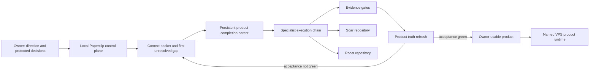

# Local Softwarehouse V0 Implementation Plan

Date: 2026-07-22  
Status: active implementation contract  
Owner: LuckySparrow board  
Execution control plane: local Paperclip on Windows  
Product order: Soar first, Roost second

## 1. Decision

V0 is not a reduced version of the future autonomous company. V0 is the
complete local autonomous softwarehouse capability required to create, finish,
verify, deploy, and maintain applications with AI agents.

Paperclip remains local in V0. Soar and Roost may and should run on VPS when
their evidence gates pass. Moving Paperclip itself to VPS and activating broad
business operations belong to V1.

The implementation must extend the existing program instead of creating a
parallel issue tree:

- `LUC-25` remains the hard V0 product-delivery parent;
- `LUC-27` remains the persistent Soar completion parent;
- `LUC-28` remains the persistent Roost completion parent;
- `LUC-1554` remains the operating-model parent for the autonomous
  problem-to-completion conveyor;
- existing specialist children remain the first execution inventory.

## 2. V0 Target Outcome

Given an approved application vision or a verified gap in an active product,
the local Softwarehouse must be able to:

1. load the smallest sufficient company, product, architecture, task, risk,
   and current-state context;
2. identify the first unresolved gap against a versioned acceptance scope;
3. classify the gap and assign one accountable owner;
4. create the smallest useful implementation or proof packet without
   duplicating existing work;
5. route it through the necessary product, architecture, engineering, QA,
   review, security, documentation, deployment, and monitoring handoffs;
6. keep same-repository writes serialized and all work traceable;
7. require inspectable evidence before completion;
8. update current product truth after acceptance;
9. wake the product owner and automatically select the next legal gap; and
10. stop only on verified product acceptance or a real, named, resolvable
    owner/protected-action blocker.

Normal forward progress must not depend on recurring manual Codex messages or
manual board mutation. The owner remains human-in-the-loop for direction,
acceptance, secrets, destructive operations, production-risk decisions, and
other explicitly protected actions.

## 3. Scope Boundary

### 3.1 Required in V0

| Capability | Required result |
| --- | --- |
| Local control plane | One canonical Paperclip runtime on `127.0.0.1:3200`, embedded PostgreSQL on strict port `54329`, supervised and recoverable. |
| Product truth | Soar and Roost have versioned intent, architecture, user-flow, gap, test, documentation, deployment, and acceptance projections grounded in their repositories and live behavior. |
| Agent workforce | Agents have scoped roles, reporting lines, instructions, tools, budgets, workspace boundaries, escalation rules, and evidence obligations. |
| Work conveyor | A durable first-unresolved-gap controller advances work through at least two automatic cross-unit handoffs and selects the next legal action. |
| Application lifecycle | Existing-app completion and later greenfield creation use the same intake, architecture, build, verification, release, and learning contract. |
| Innovation-to-product gate | Agents can assemble a versioned sale-readiness/promotion packet and route the decision without confusing deployment or registration with commercial readiness. |
| Engineering execution | Agents can implement product changes in the approved repositories with one-writer/WIP controls and reviewable source-control packets. |
| Quality and evidence | Test, review, and documentation evidence are mandatory; security, deployment, rollback, smoke, and monitoring evidence are mandatory for high-risk work. |
| VPS product delivery | Soar and Roost can be safely deployed, observed, recovered, and proven owner-usable on their named VPS targets. |
| Continuity | Routines detect stalls, stale blockers, queue gaps, duplicate work, dirty repositories, quota holds, and missing next actions without generating noise loops. |
| Recovery | Database and full-instance recovery, including local artifacts/storage and encrypted-secret-key handling, are proved in a disposable boundary. |
| Learning | Repeated failures and successful patterns become reviewed lessons, evals, instruction changes, or procedures; agents cannot silently expand their own authority. |
| Local knowledge | Markdown/CSV company projections, product-repository docs, issue plans, work products, and evidence are routed as bounded context rather than injected wholesale. |

### 3.2 Explicitly deferred to V1

- hosting Paperclip on VPS;
- autonomous business-plan management;
- broad CRM, lead generation, sales, marketing, finance, HR, customer-success,
  procurement, or legal operations;
- autonomous sending of offers, email, or customer communications;
- ClickUp and Google Drive bidirectional writes;
- full Roost-backed operation of all company departments;
- broad Paperclip-to-Roost write authority;
- commercial launch or sale of access without a separate versioned
  sale-readiness decision;
- activation of unrelated product repositories or new greenfield products
  before the Softwarehouse repeatedly proves completion capability.

A bounded read-only Paperclip-to-Roost canary may run during V0 only as a
transition aid. It is not a V0 completion prerequisite unless an active Soar or
Roost acceptance path actually depends on it.

## 4. Canonical Architecture

Source-of-truth boundaries remain:

- Paperclip: agents, assignments, issues, runs, routines, budgets, approvals,
  evidence gates, and operational history;
- product repositories: product intent, architecture, code, tests,
  deployment contracts, and actual behavior;
- local Softwarehouse docs and `.agents/state`: company standards, decisions,
  current mission, and reviewed operating memory;
- Roost: future central company knowledge and management plane, consumed
  through governed API/MCP as its interfaces mature.

## 5. Delivery Workstreams

### W0. Reconcile current truth and freeze the boundary

Outcome: every controller, instruction, issue, and acceptance statement agrees
that V0 is the local application-building Softwarehouse, while only Soar and
Roost are V0 VPS targets.

Actions:

1. Complete `LUC-1571` after the current source-control packet releases its
   writer lock.
2. Audit the 39 agent instruction bundles for named V0/V1 scope, product
   target, workspace, evidence, and escalation references.
3. Treat `LUC-25`, `LUC-27`, `LUC-28`, and `LUC-1554` as canonical; archive or
   cross-link aliases rather than creating competing completion parents.
4. Regenerate current-state indexes only from verified repository, runtime,
   API, and evidence facts.

Exit evidence: instruction audit PASS, no ambiguous hosted target, no duplicate
active completion parent, and refreshed solution/project-truth indexes.

### W1. Close the autonomous problem-to-completion conveyor

Outcome: unfinished applications continue through legal work without manual
board repair.

Actions:

1. Finish `LUC-1562`: implement and review the bounded transition coordinator
   and routine-chain materialization.
2. Finish `LUC-1563`: prove two automatic cross-unit handoffs and all required
   negative paths.
3. Finish `LUC-1565`: obtain independent source-control and maintainability
   disposition for the packet.
4. Let the accountable COO integrate evidence and close `LUC-1554` only when
   the live Soar and Roost readback confirms the invariant.

The controller must enforce:

- one persistent product parent per active application;
- first unresolved gap, not bulk issue generation;
- one accountable owner per issue;
- `todo` or live work for runnable inventory; `backlog` alone is insufficient;
- same-repository WIP/one-writer serialization;
- idempotent child creation and wakeups;
- explicit blocker owner, resolution mechanism, and next check;
- accepted-child integration, product-truth refresh, and PM wakeup;
- separate decisions for commit, push, deploy, and production acceptance.

Exit evidence: `LUC-1563` PASS, including two automatic handoffs and expected
failure for early parent closure, backlog-only queue, wrong workspace, and a
second writer against a dirty repository.

### W2. Make product completion mechanically decidable

Outcome: agents can distinguish a real product defect from missing proof and
can determine what remains without guessing.

Actions:

1. Maintain a versioned acceptance scope for each active application.
2. Map required user outcomes to architecture components, frontend/backend,
   data, auth, configuration, integrations, tests, docs, runtime, and owner
   acceptance.
3. Classify each gap as code defect, missing proof, documentation drift,
   source-control packet, external dependency, protected action, or
   product/architecture decision.
4. Generate the next issue only after checking current issues, blockers,
   workspaces, runs, work products, and repository state for an existing owner.
5. Update the completion index only from inspectable evidence.
6. Exercise greenfield intake against the existing application template or a
   non-destructive fixture: vision, target user, bounded scope, architecture,
   repository/workspace plan, acceptance map, risks, and initial issue graph.
   This proves creation capability without activating a third product.
7. Produce an innovation-to-product promotion packet when an application is
   technically and operationally ready. The packet may recommend promotion,
   but it does not authorize pricing, public launch, customer commitments, or
   sales activity.

Exit evidence: each open gap has a type, accountable unit, next legal action,
dependency, evidence requirement, and freshness timestamp; no unowned or
duplicated runnable gap remains. The greenfield fixture passes review without
creating a live portfolio lane, and the promotion packet has an explicit owner
decision gate.

### W3. Finish Soar through the complete factory

Outcome: `LUC-27` reaches owner-usable acceptance without bypassing protected
production gates.

Execution order:

1. close current Paperclip/Soar source-control packets;
2. resolve the active Soar readiness and credential/provenance chains through
   their named owner/security approvals;
3. drain Soar project-truth gaps evidence-first, creating code work only when
   inspection proves a defect;
4. run relevant automated tests, independent QA/review, browser user-flow
   proof, security/secrets checks, deployment/rollback proof, public readiness,
   monitoring, and documentation refresh;
5. obtain owner-usable acceptance and update current product truth;
6. close `LUC-27` only after all versioned acceptance rows are green or an
   explicitly accepted residual risk is recorded.

Exit evidence: named URL and build/version, healthy readiness, owner-critical
flows, required worker paths, test/review/docs/security/deploy/monitoring
evidence, clean source-control disposition, residual risks, and rollback path.

### W4. Finish Roost through the same factory

Outcome: `LUC-28` proves that the Softwarehouse can repeat the process instead
of succeeding only for Soar.

Actions mirror W3, using Roost's own product truth and acceptance scope. Roost
must additionally prove the existing company-management capabilities required
for its declared V0 product scope. Future ClickUp/Drive bidirectional sync and
the full twelve-department company plane remain V1 unless already part of an
explicit Roost V0 acceptance contract.

Exit evidence: the same evidence classes as Soar, plus Roost-specific data,
permission, audit, API/MCP, and recovery evidence required by its versioned
scope.

### W5. Prove resilience and bounded autonomy

Outcome: local operation survives expected failures without corrupting company
or product state.

Actions:

1. Complete `LUC-1570` after Soar acceptance: disposable full-instance restore
   covering database, uploads/storage, encrypted secret-key restoration,
   secret resolution, artifact readback, and cleanup.
2. Exercise restart, stale-run, quota-hold, agent-pause, provider-unavailable,
   dirty-repository, wrong-workspace, duplicate-trigger, and missing-evidence
   behavior.
3. Verify protected operations remain fail-closed and no raw secret reaches
   prompts, logs, issues, docs, or artifacts.
4. Verify routine health, schedule ownership, deduplication, bounded retries,
   and explicit escalation after retry exhaustion.

Exit evidence: recovery drill PASS, continuity/eval PASS, no orphaned process
or temporary database, and a named monitoring signal for each critical loop.

### W6. Institutionalize learning without authority drift

Outcome: the factory improves from reviewed evidence while remaining governed.

Actions:

1. Convert repeated failures into an eval, procedure, instruction correction,
   or controller regression test.
2. Require an accountable reviewer before promoting an observation into
   current truth or active instructions.
3. Measure whether the change improved handoff success, cycle time, defect
   escape, rework, or owner interventions.
4. Reject stale or harmful observations and preserve audit history.
5. Never allow an agent to grant itself new tools, secrets, budget, production
   authority, or communication authority.

Exit evidence: at least one closed learning loop tied to a real Soar or Roost
failure, with before/after eval and an explicit promotion decision.

## 6. Execution Sequence

The next legal stage is selected from evidence, not from a calendar promise:

| Gate | Work | Start condition | Finish condition |
| --- | --- | --- | --- |
| G0 | Scope/current-truth reconciliation | This plan accepted | Canonical parents and V0/V1 wording agree |
| G1 | Conveyor closure | Existing `LUC-1562` packet | `LUC-1554` acceptance eval and review PASS |
| G2 | Soar completion | G1 can safely route work | `LUC-27` owner-usable acceptance PASS |
| G3 | Roost completion | Soar frees the serialized product lane | `LUC-28` owner-usable acceptance PASS |
| G4 | Resilience and repeatability | Soar accepted; safe disposable boundary available | `LUC-1570` plus continuity and learning evidence PASS |
| G5 | V0 acceptance | G1-G4 green | `LUC-25` and the V0 scorecard pass; owner accepts residual risk |

Independent read-only review or governance work may proceed in parallel only
when it does not create another writer or outrank the current completion lane.

## 7. V0 Acceptance Scorecard

V0 is complete only when all rows are green:

| Acceptance dimension | Required proof |
| --- | --- |
| Control-plane health | Canonical runtime/topology, database, roster, instructions, routines, budgets, quotas, secrets provider, and workspace audits pass. |
| Conveyor liveness | A real product gap advances through two automatic cross-unit handoffs; negative-path evals fail correctly; next-gap selection is automatic. |
| Soar completion | `LUC-27` is owner-usable with current application, test, review, docs, security, deploy, smoke, monitoring, and source-control evidence. |
| Roost completion | `LUC-28` meets the equivalent versioned acceptance contract. |
| Evidence integrity | No completion occurs from narrative claims alone; evidence links are typed, inspectable, current, and independently reviewed where required. |
| Safety | Protected, destructive, secret, deployment, budget, and external-effect actions remain fail-closed and owner-governed. |
| Recovery | Full-instance disposable restore and readback pass without exposing secrets or affecting the canonical instance. |
| Repeatability | The same lifecycle finishes Soar and Roost, and a failure-derived learning improvement passes regression. |
| Creation readiness | A non-destructive greenfield intake/template eval produces a coherent architecture, acceptance map, issue topology, and governed workspace plan without activating an unapproved product. |
| Lifecycle transition | The innovation-to-product packet distinguishes technical/operational readiness from commercial activation and requires owner acceptance. |
| Human role | The owner sets direction and handles protected decisions, but recurring manual task routing or Codex board repair is not required for normal progress. |
| Documentation | Product truth, architecture, runbooks, residual risks, current focus, and V0/V1 boundary match verified reality. |

`100%` means all requirements in the declared, versioned V0 scope are proven.
It does not mean the applications can never have another defect or feature.

## 8. Issue and Evidence Rules

Before creating any new issue, the controller must search existing active and
blocked work by product, acceptance row, gap identity, repository, and evidence
class. New work is justified only when no current issue owns the gap or when a
reviewed parent explicitly decomposes it.

Every executable issue must contain or link:

- objective and bounded scope;
- accountable owner and required specialist handoffs;
- product/repository/workspace identity;
- dependencies and first legal action;
- acceptance criteria and required evidence classes;
- risk/protected-action classification;
- source-control disposition;
- next action or named blocker before the run ends.

Plans live in issue plan documents for issue-specific execution. Durable files
produced as deliverables become work products or uploaded artifacts. Repository
docs record only stable standards, cross-issue plans, and promoted truth.

## 9. V1 Handoff Packet

V0 produces a migration packet; it does not perform the migration. The packet
must contain:

- accepted V0 scorecard and residual-risk register;
- Paperclip runtime, backup, restore, secret-reference, and topology runbooks;
- stable company, department, offering, project, work, actor, and evidence IDs;
- Roost API/MCP and read-only canary findings, if the canary was run;
- authority matrix for the first hosted phase;
- explicit non-authorizations for external writes and communications;
- rollback and observability requirements for moving Paperclip to VPS.

Only an owner decision after V0 acceptance starts V1. V1 may then host
Paperclip, expand the Roost connection, and progressively activate business
departments from observe to draft, per-action approval, bounded autonomy, and
exception supervision.

## 10. Immediate Next Action

Do not seed a new program. Resume the current `LUC-1554` chain:

1. review and integrate `LUC-1562` only if the coordinator is genuinely
   implemented;
2. unblock and run `LUC-1563` for the mandatory handoff and negative-path
   evidence;
3. complete independent `LUC-1565` source-control closure;
4. let COO evaluate `LUC-1554` against live `LUC-27`/`LUC-28` readback;
5. route the first verified Soar gap and continue until `LUC-27` passes.

This is the shortest path from the current factual state to the requested V0.
